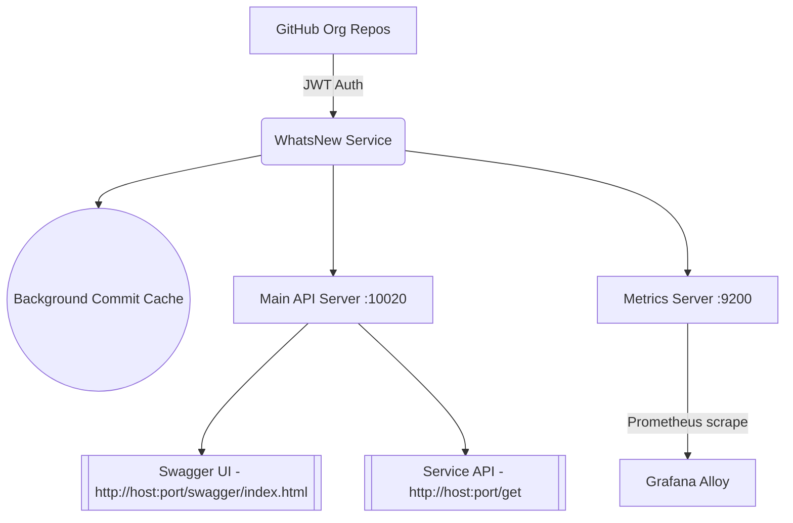

# 🧠 WhatsNew Service – Org-Wide GitHub Activity Tracker

---

## 📊 High Level Design



---

## 🎉 CX Pipeline Status

```mermaid
flowchart LR
  subgraph Inputs
    A1[⬇️ Git Commit Push]
    A2[⬇️ SAST Sec Suite\nhttps://github.com/dasmlab/sec_suite]
    A3[⬇️ Test FW Suite\ndasmlab/test_suite]
  end
  A1 --> B1[🛠️ BUILD]
  B1 --> B2[▶️ RUN]
  B2 --> B3[🔒 SECURE]
  B3 --> B4[✅ VALIDATE]
  B4 --> B5[📤 PUBLISH]
  B5 --> B6[🔄 GitOps Sync]

  %% Inputs
  A2 --> B3
  A3 --> B4

  %% Downward outputs
  B2 --> |Isolated Instance| C1[🏗️ Running App]
  B3 --> |Security Reports| C2[📝 CVE/Scan/Compliance]
  B4 --> |Test Reports| C3[🧪 Test FW Reports]
  B5 --> |Container + Build Report| C4[📦 Container]
  B6 --> |Manifest| C5[🔎 GitOps Repo]

> _Inputs above each phase show what triggers/enriches each build step. Down arrows represent outputs (reports, manifests, containers, etc)._

---

## 🚀 Features

- 🔐 **GitHub App OAuth2 Auth**
  - JWT-based token exchange using GitHub App (Org-level)
  - Repo visibility is scoped by App configuration (Free Tier supported)
  - No PATs — org admins retain fine-grained access control

- ⚙️ **Fully Dockerized + CI/CD Ready**
  - Clean multi-stage Docker builds
  - GitHub Actions pipeline with FluxCD-compatible GitOps output

- 📈 **Out-of-Band Prometheus Metrics**
  - Second server on `:9200` for scrape-only Prometheus
  - Uses `ginprom` middleware (no noise on business endpoints)

- 🔄 **Dynamic Repo Discovery**
  - All accessible repos via Installation Token pulled at runtime
  - Top 2 commits cached per repo each refresh cycle

- 🧰 **Tech Stack**
  - Go 1.21+
  - Gin, Logrus, Swaggo (Swagger), GinPrometheus

---

## 🧪 Local Development

### 🧰 Requirements

- Go 1.21+
- Docker
- GitHub App:
  - With `.pem` key
  - `APP_ID` and `INSTALLATION_ID`

### 🔧 Required Environment Variables

| Variable           | Description                                  |
|--------------------|----------------------------------------------|
| `APP_ID`           | GitHub App ID                                |
| `INSTALLATION_ID`  | App Installation ID                          |
| `PEMFILE`          | Path to GitHub App `.pem` key                |

---

### 🛠️ Build Locally

```bash
./buildme.sh
```

### ▶️ Run Locally (Dockerized)

```bash
./runme_local.sh
```

---

## 📦 CI/CD & GitOps Workflow

- GitHub Actions workflow: `main.yaml`
- Steps:
  - Build Docker image
  - Run container healthchecks
  - Publish to GHCR
  - Generate manifest (version-tagged)
  - Push to GitOps repo (Flux watches)

---

## 📊 Metrics

- **Exposed at:** `http://localhost:9200/metrics`
- **Scraped by:** Prometheus, Grafana Alloy
- **Powered by:** [`ginprom`](https://github.com/Depado/ginprom)

---

## 📜 Swagger API Docs

```
http://localhost:10020/swagger/index.html
```

Try endpoints like `/api/whatsnew` interactively.

---

## 🧪 Example: API Call

```bash
curl http://localhost:10020/api/whatsnew
```

Returns latest commits (2 per repo) from all visible GitHub org repos.

---

## 🪪 Credits

MIT License © DASMLAB 2025

Built with:

- [Gin](https://github.com/gin-gonic/gin)
- [Logrus](https://github.com/sirupsen/logrus)
- [Swaggo](https://github.com/swaggo/swag)
- [GinPrometheus](https://github.com/Depado/ginprom)
