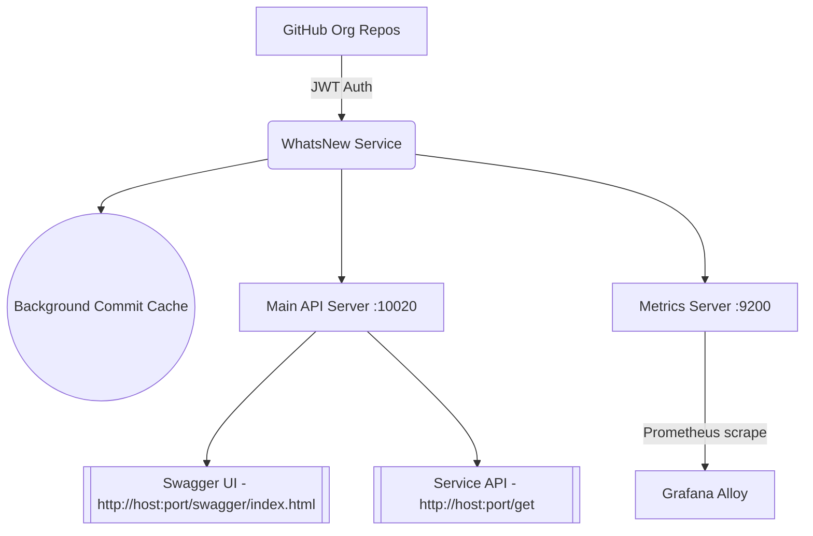
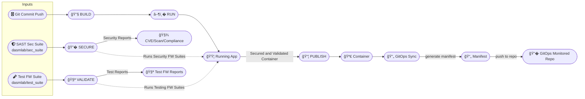

# 🧠 WhatsNew Service – Org-Wide GitHub Activity Tracker

---

## 📊 High Level Design



--- 

## Pipeline Status

[](https://github.com/dasmlab/whatsnew-service/actions/workflows/main.yaml)


---

## â~_~S~J CX Pipeline Overview 



> _Inputs above each phase show what triggers/enriches each build step. Down arrows represent outputs (reports, manifests, containers, etc)._

---

## 🚀 Features

- � **GitHub App OAuth2 Auth**
  - JWT-based token exchange using GitHub App (Org-level)
  - Repo visibility is scoped by App configuration (Free Tier supported)
  - No PATs — org admins retain fine-grained access control

- ⚙� **Fully Dockerized + CI/CD Ready**
  - Clean multi-stage Docker builds
  - GitHub Actions pipeline with FluxCD-compatible GitOps output

- 📈 **Out-of-Band Prometheus Metrics**
  - Second server on `:9200` for scrape-only Prometheus
  - Uses `ginprom` middleware (no noise on business endpoints)

- 🔄 **Dynamic Repo Discovery**
  - All accessible repos via Installation Token pulled at runtime
  - Top 2 commits cached per repo each refresh cycle

- 🧰 **Tech Stack**
  - Go 1.21+
  - Gin, Logrus, Swaggo (Swagger), GinPrometheus

---

## 🧪 Local Development

### 🧰 Requirements

- Go 1.21+
- Docker
- GitHub App:
  - With `.pem` key
  - `APP_ID` and `INSTALLATION_ID`

### 🔧 Required Environment Variables

| Variable           | Description                                  |
|--------------------|----------------------------------------------|
| `APP_ID`           | GitHub App ID                                |
| `INSTALLATION_ID`  | App Installation ID                          |
| `PEMFILE`          | Path to GitHub App `.pem` key                |

---

### 🛠� Build Locally

```bash
./buildme.sh
```

### ▶� Run Locally (Dockerized)

```bash
./runme_local.sh
```

---

## 📦 CI/CD & GitOps Workflow

- GitHub Actions workflow: `main.yaml`
- Steps:
  - Build Docker image
  - Run container healthchecks
  - Publish to GHCR
  - Generate manifest (version-tagged)
  - Push to GitOps repo (Flux watches)

---

## 📊 Metrics

- **Exposed at:** `http://localhost:9200/metrics`
- **Scraped by:** Prometheus, Grafana Alloy
- **Powered by:** [`ginprom`](https://github.com/Depado/ginprom)

---

## 📜 Swagger API Docs

```
http://localhost:10020/swagger/index.html
```

Try endpoints like `/api/whatsnew` interactively.

---

## 🧪 Example: API Call

```bash
curl http://localhost:10020/api/whatsnew
```

Returns latest commits (2 per repo) from all visible GitHub org repos.

---

## 🪪 Credits

MIT License © DASMLAB 2025

Built with:

- [Gin](https://github.com/gin-gonic/gin)
- [Logrus](https://github.com/sirupsen/logrus)
- [Swaggo](https://github.com/swaggo/swag)
- [GinPrometheus](https://github.com/Depado/ginprom)
